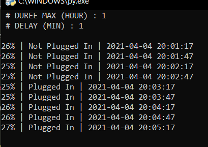

# Battery Analysis
Programme qui enregistre les informations de la batterie.

### ⚙ How to run it

Run save.py file pour commencer l'enregister. 
Un fichier csv quand la durée d'execution dépassera la durée maximal.

### the story of the code

Mon nouveau pc de l'école a perdu de ouf en autonomie. Je sais déjà que c'est dûe au fait que je l'utilise comme si c'était un pc fixe, h24 branché au secteur, alors que je sais très bien que ça bz la batterie.

Pourquoi j'ai fait ça ? Jsais mm pas, j'aime bien les graphiques.

### 📸 Screenshots 

---
[Mlamali SAID SALIMO](https://www.linkedin.com/in/mlamalisaidsalimo)   
